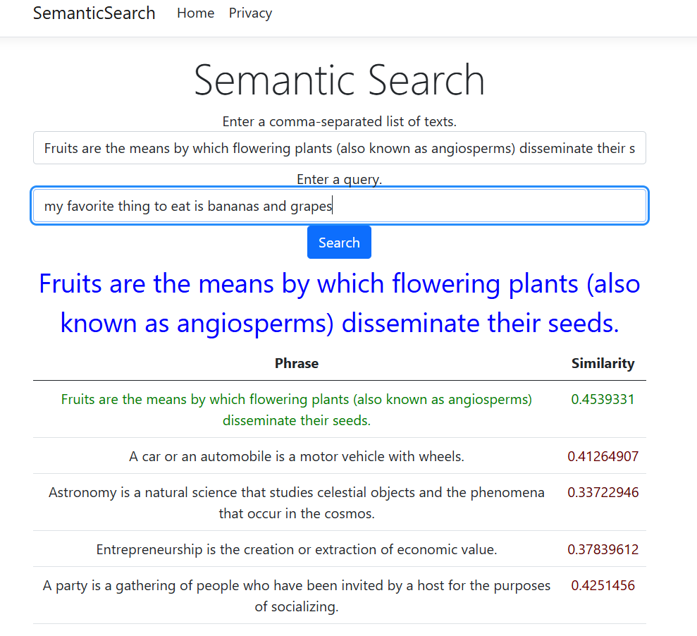

Semantic Search
===============

A demo of AI semantic search where a query is matched by context and meaning, rather than keyword.

## About

Semantic Search lets you search across a set of documents using a query based on context and meaning, rather than keyword matching.

The app works by using the Cohere large language model (LLM) to retrieve embeddings for the query and the list of items in the database. A cosine similiarity score is calculated for each database item against the query. The best match is highlighted.

The app uses artificial intelligence with an LLM to calculate embeddings. An embedding is a numerical representation of a piece of text and includes many features including meaning, context, size, color, shape, topic, etc. Each feature is converted into a floating point value to create a vector.

**Example of an embedding**

```
the cat and the fox => [ 0.12, 0.55, 0.76, 0.11, 0.87, .. ]
```

Similarity is then be calculated for the embeddings by comparing the distance between the query vector and each database item vector.

## Screenshot



## Quick Start

Install the required libraries in VSCode before running the project.

1. Open a Terminal in VSCode.
2. Create a file `.env` with the contents:
    ```
    CohereApiKey=<YOUR_API_KEY>
    OpenAIApiKey=<YOUR_API_KEY>
    ````

*You can register a Cohere API key [here](https://dashboard.cohere.com/api-keys).*

*You can register an OpenAI API key [here](https://platform.openai.com/account/api-keys).*

### Deployment

To build a deployment for hosting on a web server, use the following steps.

1. In Visual Studio Code, run the **Publish** build step.
2. Copy the `.env` file into `/publish` and add your API key for Cohere.
4. Run the executable `/pubish/SemanticSearch.exe`

The web application will begin running on port 5000. The executable is a self-contained web server, similar to a node.js application, and may be deployed to a Windows web server or Microsoft Azure.

### Persist Embeddings

Applications should save retrieved embeddings to a database to prevent the need to call the LLM for documents that have already been processed. Ideally, this should be a vector database, which is designed to store embeddings and perform built-in similarity calculations. However, to keep this project simple, embeddings are *always* retrieved from the LLM.

See the branch [database](https://github.com/primaryobjects/SemanticSearch/tree/database) for saving the embeddings to a local database as a cache.

## Tech Stack

- Visual Studio Code
- C# .NET 8.0
- Razor
- LLM Cohere and OpenAI

## License

MIT

## Author

Kory Becker http://www.primaryobjects.com/kory-becker
